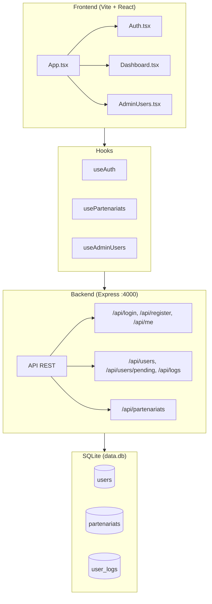
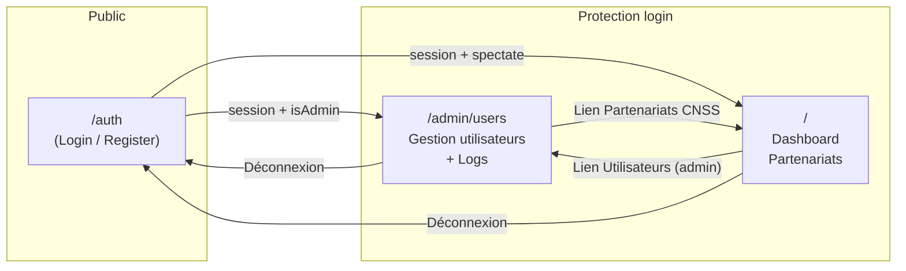
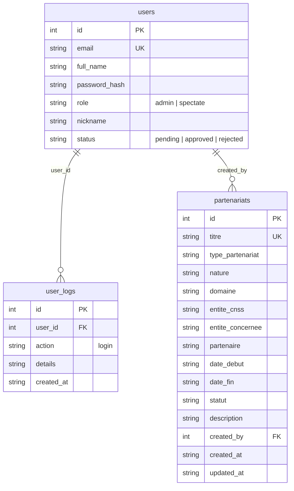
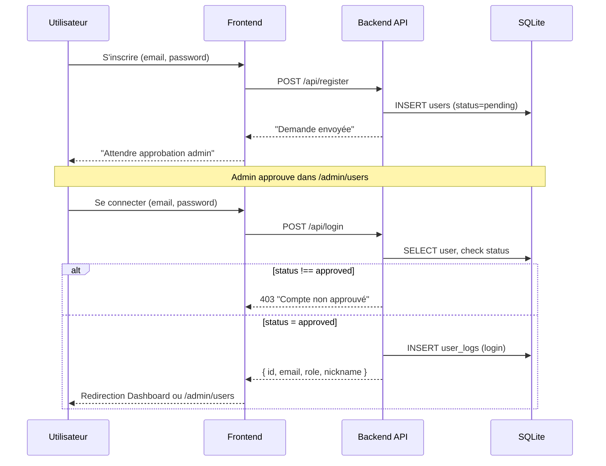
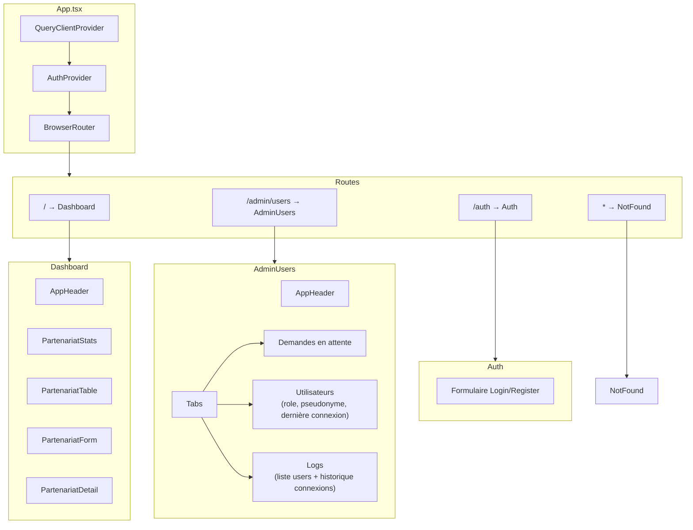
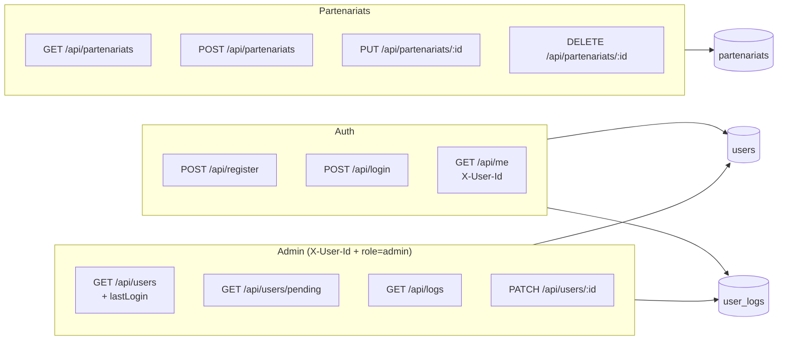

# Diagrammes Mermaid – Projet Partenariats CNSS

Copiez chaque bloc de code dans un visualiseur Mermaid (ex: [mermaid.live](https://mermaid.live)) ou dans un README pour les voir rendus.

---

## 1. Architecture globale

---

## 2. Routes et navigation

---

## 3. Base de données (tables)

---

## 4. Flux Auth (inscription → approbation → connexion)

---

## 5. Structure des pages et composants (frontend)

---

## 6. API Backend (résumé)

Vous pouvez coller n’importe quel bloc dans [mermaid.live](https://mermaid.live) pour obtenir le diagramme.
